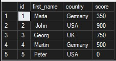

# First steps in SQL: SELECT/TOP/DISTINCT/WHERE/GROUP BY/HAVING/ORDER BY exercises and notes.


# SQL Task 01  
### Retrieve All Customer Data  

**Solution**

```sql
-- Returns all columns and all rows from the "customers" table
SELECT *
FROM customers;
```

**Result**



# SQL Task 02
### Retreive each customers name, country and score

**Solution**

```sql
-- Selects only the first_name, country, and score columns from the customers table 
SELECT first_name, country, score 
FROM customers
```

**Result**
