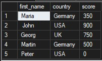
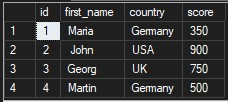
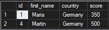
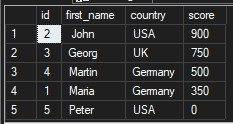
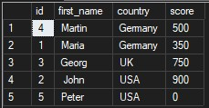
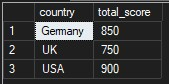
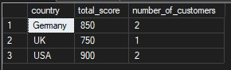
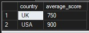

# First steps in SQL: SELECT/TOP/DISTINCT/WHERE/GROUP BY/HAVING/ORDER BY exercises and notes.


# SQL Task 01  
### Retrieve All Customer Data  

**Solution**

```sql
-- Returns all columns and all rows from the "customers" table
SELECT *
FROM customers;
```

**Result**


# SQL Task 02
### Retreive each customers name, country and score

**Solution**

```sql
-- Selects only the first_name, country, and score columns from the customers table 
SELECT first_name, country, score 
FROM customers
```

**Result**




# SQL Task 03
### Retreive each customers with a score not equal to 0

**Solution**

```sql
SELECT *
FROM customers
WHERE score != 0
```

**Result**



# SQL Task 04
### Retreive customers from Germany

**Solution**

```sql
SELECT *
FROM customers
WHERE country = 'Germany'
```

**Result**




# SQL Task 05
### Retreive all customers and sort the results by the highest score first

**Solution**

```sql
SELECT *
FROM customers
ORDER BY score DESC
```

**Result**




# SQL Task 06
### Retrieve all customers and sort the results by country and then by the highest score

**Solution**

```sql
SELECT *
FROM customers
ORDER BY country ASC, score DESC
```




# SQL Task 07
### Find the total score for each country

**Solution**

```sql
SELECT country, SUM(score) AS total_score
FROM customers
GROUP BY country
```

**Result**




# SQL Task 08
### Find the total score and total number of customers for each country

**Solution**

```sql
SELECT	country, 
		SUM(score) AS total_score, 
		COUNT(first_name) AS number_of_customers
FROM customers
GROUP BY country
```

**Result**




# SQL Task 09
### Find the average score for each country considering only customers with a score not equal to 0 and return only those countries with an average score greater than 430

**Solution**

```sql
SELECT	country, 
		AVG(score) AS average_score
FROM customers
WHERE score != 0
GROUP BY country
HAVING AVG(score) > 430
```

**Result**


