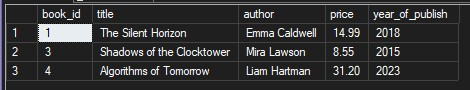

# DDL & DML Operations (CREATE ALTER DROP INSERT UPDATE DELETE)

## ⭐ Task 01 — Create a table for storing books with the following columns: book_id, title, author, published_year, price

**Solution**

```sql
CREATE TABLE book_storage(
	book_id INT NOT NULL,
	title VARCHAR(150) NOT NULL,
	author VARCHAR(100) NOT NULL,
	published_year INT,
	price DECIMAL(10,2)
	CONSTRAINT pk_storage PRIMARY KEY (book_id)
)

SELECT *
FROM book_storage
```

**Result**


## ⭐ Task 02 — Delete "published_year" column and add new column "year_of_publish"

**Solution**

```sql
ALTER TABLE book_storage
DROP COLUMN published_year

ALTER TABLE book_storage
ADD year_of_publish INT 

SELECT *
FROM book_storage
```

**Result**


## ⭐ Task 02 — Insert given data to table:
### 1       | The Silent Horizon            | Emma Caldwell        | 14.99 | 2018
### 2       | Quantum Sands                 | Dr. Aaron Whitfield  | 22.50 | 2021
### 3       | Shadows of the Clocktower     | Mira Lawson          | 9.75  | 2015

## Update data by changing the price of last book to 8.55
## Delete the second row from the table.
## Insert the following data into the table.
4       | Algorithms of Tomorrow        | Liam Hartman         | 31.20 | 2023


**Solution**

```sql


SELECT *
FROM book_storage
```

**Result**


